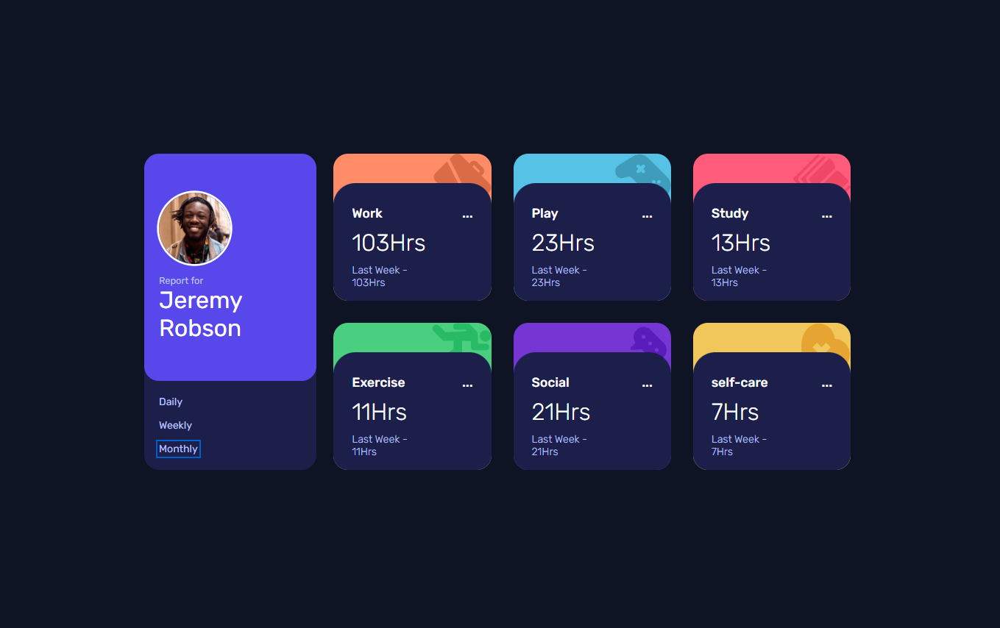
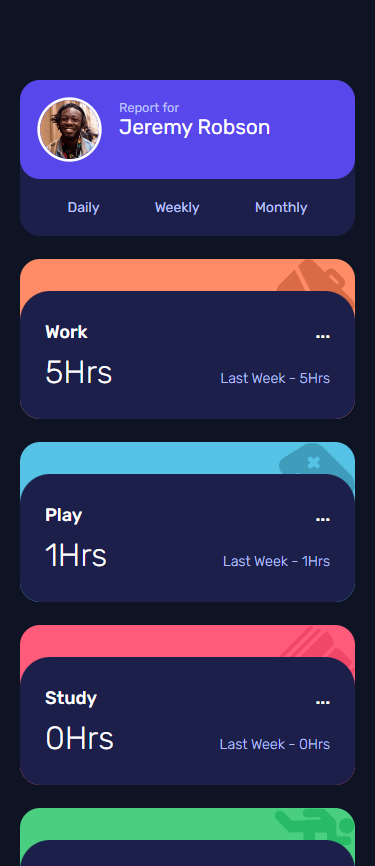

# Frontend Mentor - Time Tracking App

Welcome to the **Frontend Mentor - Time Tracking App** repository! This project is a solution to the Time Tracking App challenge from Frontend Mentor. In this README, you’ll find an overview of the project, its features, the technology stack used, a breakdown of the code structure, screenshots of the application, licensing information, and contact details.

## Table of Contents

- [Overview](#overview)
- [Features](#features)
- [Tech Stack](#tech-stack)
- [Code Breakdown](#code-breakdown)
- [Screenshots](#screenshots)
- [License](#license)
- [Contact](#contact)

---

## Overview

The Time Tracking App is a single-page application designed to help users manage and track their time spent on various tasks throughout the day. The application features a clean and user-friendly interface with interactive elements that allow users to view their time-tracking data and switch between different views.

This project was built as part of the Frontend Mentor challenge to practice and demonstrate skills in front-end development, focusing on creating responsive and visually appealing web applications.

## Features

- **Interactive Dashboard**: View time-tracking data in a visually appealing dashboard.
- **Daily, Weekly, and Monthly Views**: Switch between different time frames to analyze time spent on tasks.
- **Responsive Design**: The app adapts to different screen sizes and devices.
- **Detailed Insights**: View detailed breakdowns of time spent on various activities.
- **Theme Switcher**: Toggle between light and dark modes for a customized experience.

## Tech Stack

The Time Tracking App is built using a variety of technologies and tools:

- **HTML5**: For structuring the content of the web pages.
- **CSS3**: For styling the web pages and implementing responsive design.
- **JavaScript**: For implementing dynamic features and interactivity.
- **React**: For building the user interface components and managing state.
- **SASS**: For advanced CSS styling and organization.
- **Webpack**: For bundling and optimizing the application’s assets.
- **ESLint**: For ensuring code quality and consistency.
- **Prettier**: For maintaining code formatting standards.

## Code Breakdown

Here’s a brief overview of the main components and files in the project:

- **`/src`**: Contains the source code for the application.
  - **`/components`**: Reusable React components used throughout the app.
  - **`/assets`**: Images, fonts, and other static files.
  - **`/styles`**: SCSS files for styling the components and pages.
  - **`/data`**: JSON files containing mock time-tracking data.
  - **`App.js`**: Main component that integrates all the other components.
  - **`index.js`**: Entry point for the React application.

- **`/public`**: Publicly accessible files such as `index.html`.

- **`webpack.config.js`**: Configuration file for Webpack.

- **`.eslintrc.json`**: ESLint configuration file.

- **`.prettierrc`**: Prettier configuration file.

## Screenshots

Here are some screenshots of the Time Tracking App:

**Desktop View**

**Mobile View**

## License

This project is licensed under the [MIT License](https://opensource.org/licenses/MIT). See the [LICENSE](https://github.com/AReactDeveloper/FronedEnd-mentor-timetracking-app/blob/main/LICENSE) file for more details.

## Contact

If you have any questions or feedback, feel free to reach out:

- **Name**: AReactDeveloper
- **GitHub**: [AReactDeveloper](https://github.com/AReactDeveloper)
- **Email**: areactdeveloper@example.com

Thank you for checking out this project! If you found it helpful or interesting, please consider giving it a star on GitHub 🌟.

---

Happy coding!

